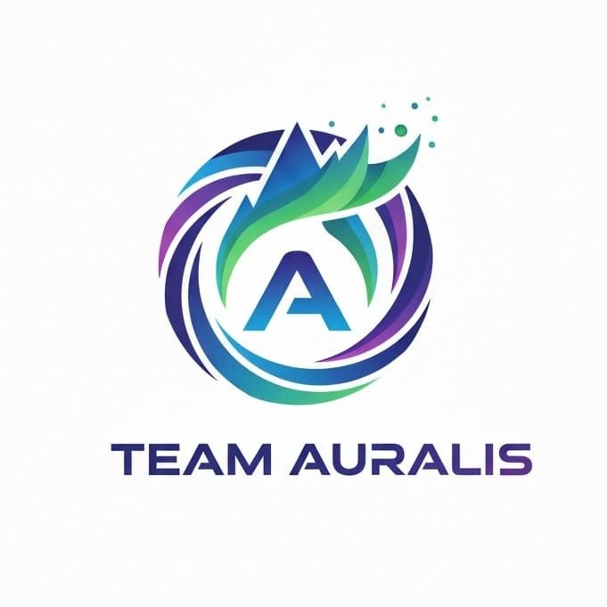
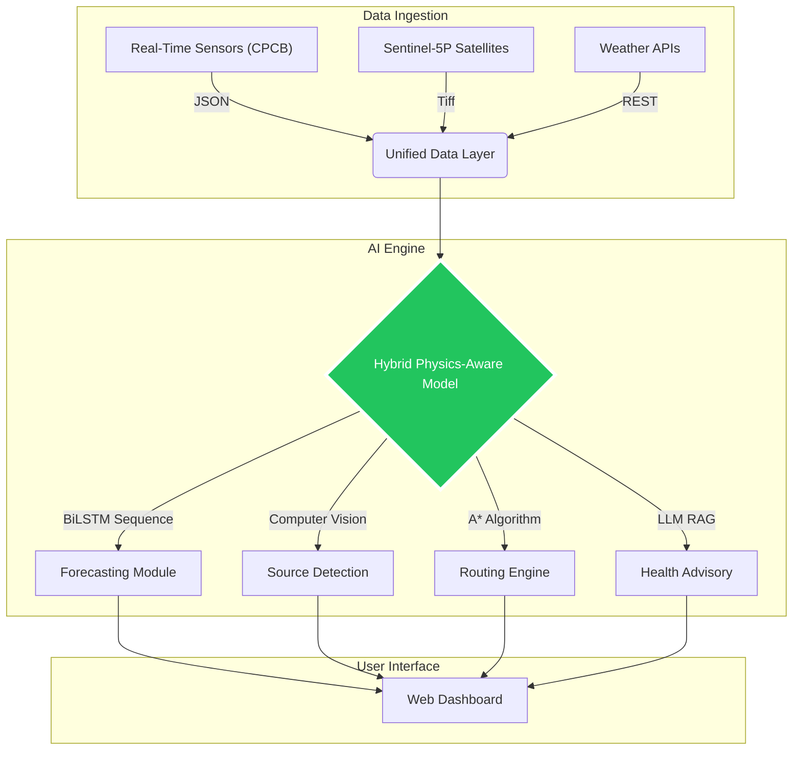
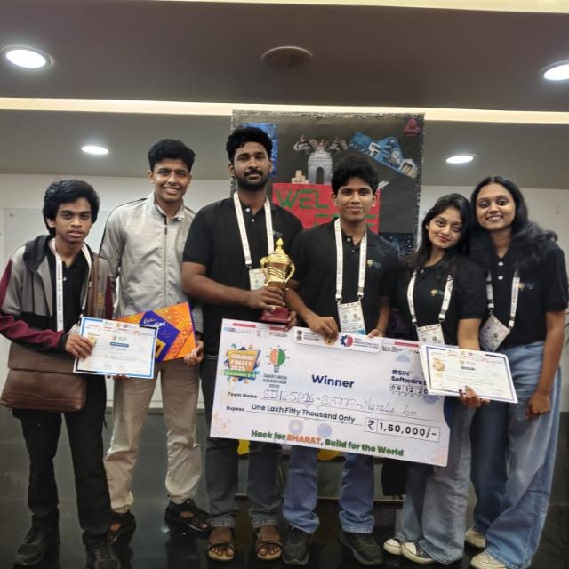

# 🌿 AURALIS: The Future of Urban Air Quality Management

<div align="center">



<h3>🏆 Winner - Smart India Hackathon 2025 (SIH25216) 🏆</h3>

<a href="https://git.io/typing-svg"></a>

<br>

[](LICENSE)
[](https://github.com/antonyjoseph2111/auralis)
[](http://makeapullrequest.com)

<p>
  <b>Auralis</b> is an integrated multi-modal system designed to combat the air pollution crisis in Delhi-NCR. <br>
  We leverage <b>Physics-Aware Deep Learning</b>, <b>Satellite Intelligence (Sentinel-5P)</b>, and <b>Graph Algorithms</b> to monitor, predict, and mitigate pollution.
</p>

<a href="#">Explore Docs</a> • <a href="#">View Demo</a> • <a href="#">Report Bug</a>

</div>

---

## 🛠️ Tech Stack & Tools

<div align="center">

| **Core AI & Data** | **Frontend & Maps** | **Backend & Cloud** | **Tools & DevOps** |
| :---: | :---: | :---: | :---: |
|  |  |  |  |
|  |  |  |  |
|  |  |  |  |
|  |  |  |  |

</div>

---

## 💎 The ClearSight Ecosystem

This repository consolidates the entire **Auralis** ecosystem into a single unified monorepo.

### 🌟 Key Modules

| Module | Description | Key Tech |
| :--- | :--- | :--- |
| **🔮 AQI Forecasting** | **72-Hour Predictions** using Hybrid Physics-Aware BiLSTM Models. Constrained by meteorological laws to prevent hallucinations. | `BiLSTM` `TensorFlow` |
| **🗺️ Pollution Routing** | **Pollution-Free Navigation** using A* Search algorithms to weigh path distance against exposure. | `Graph Theory` `Leaflet` |
| **🏭 Source ID** | **Plume Tracking** via Sentinel-5P satellite imagery to detect NO2 and aerosol plumes from space. | `Sentinel-5P` `CV` |
| **🏥 Health Advisory** | **Personalized Risk Assessment** using Gemini AI to generate custom health reports based on user profiles. | `Gemini API` `GenAI` |
| **📜 Policy Analysis** | **Counterfactual Modeling** to simulate the impact of policy interventions like Odd-Even rules. | `Data Analytics` |

---

## 🏗️ Technical Architecture



---

## 🏆 Team Auralis

We are the proud **Winners of Smart India Hackathon 2025 (SIH25216)**.

<div align="center">
    
</div>
<br>

| **Antony Joseph** | **Nate Kurian** | **Aparna Anil Nair** |
| :---: | :---: | :---: |
| 🧑‍💻 Team Leader | 🚀 Member | 🎨 Member |

| **George Tomson** | **Athul Lal SP** | **Divya Tresa Thomas** |
| :---: | :---: | :---: |
| 🔧 Member | 📊 Member | 💡 Member |

---

## 🛠️ Installation & Setup

This is a monorepo. You can run individual modules by navigating to their directories.

```bash
# Clone the master repo
git clone https://github.com/antonyjoseph2111/auralis.git
cd auralis

# Example: Run Forecasting Module
cd clearsight-aqi-forecasting
pip install -r requirements.txt
python run_pipeline.py
```

## 📜 License

Distributed under the MIT License. See `LICENSE` for more information.

---

---

<div align="center">
    <b>Star this repo 🌟 if you found it useful!</b>
    <br>
    Made with ❤️ by Team Auralis
</div>

<div align="center">


</div>
